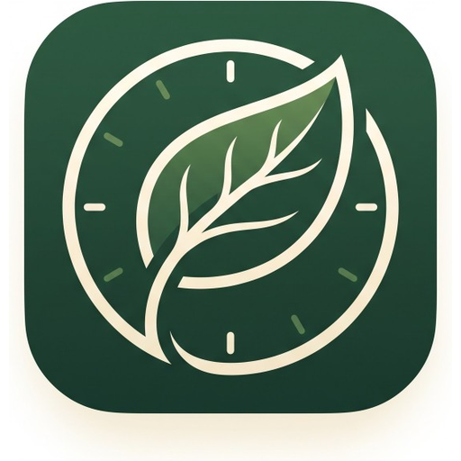
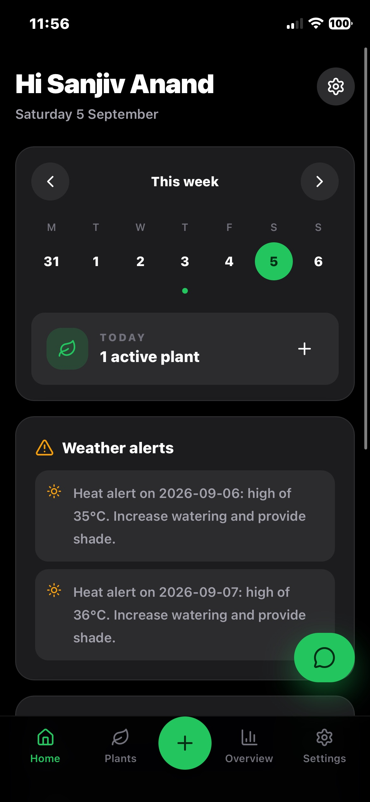
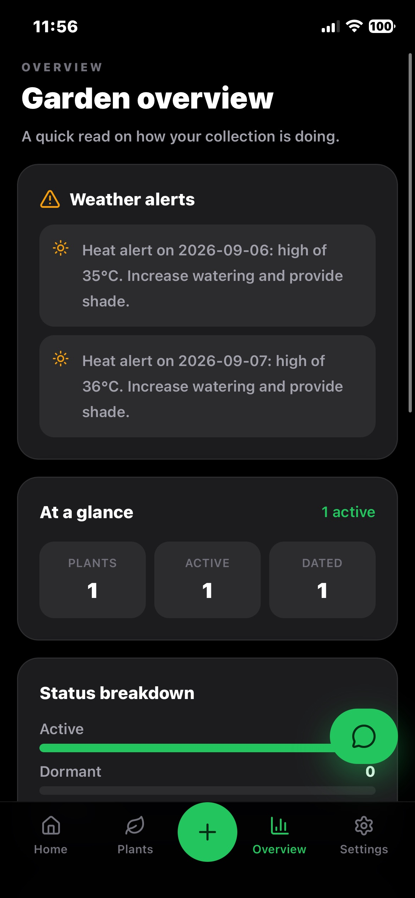
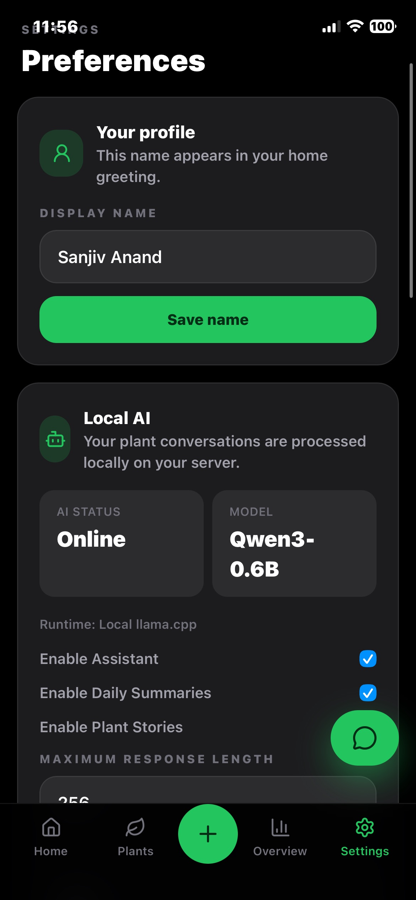
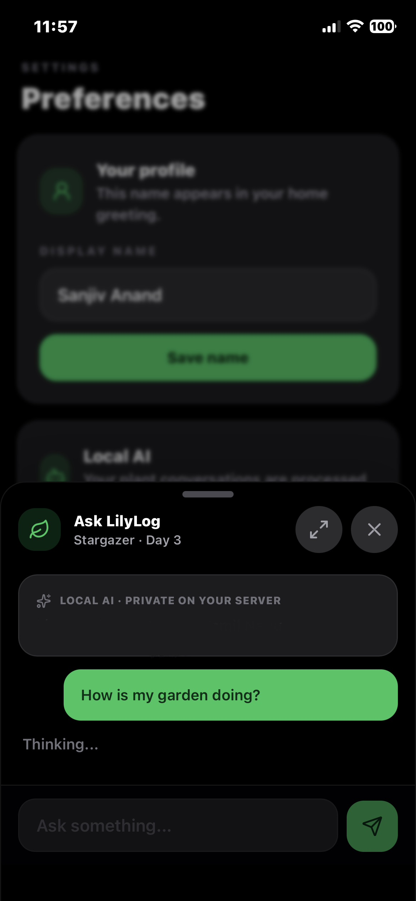
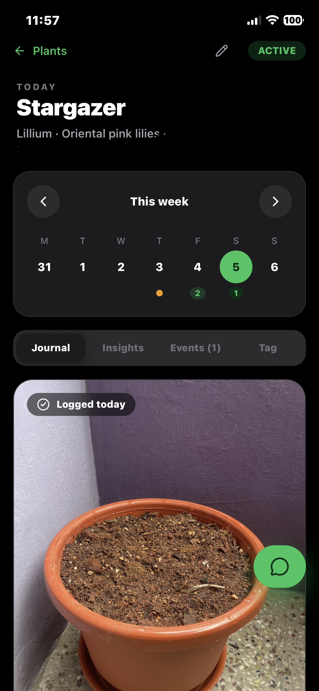

<div align="center">


<!-- 📝 TODO — replace with your actual logo -->

# 🌿 Plantory

**A self-hosted, production-oriented plant journaling and monitoring app**

Multi-plant tracking · Daily photo journaling · Weather snapshots · Timeline &amp; calendar history · Local AI assistant · Docker-first deployment

<!-- Badges — update owner/repo, workflow names, and links to match your actual CI/release setup -->
[](./LICENSE)
[](https://github.com/sanjiv-anand/Plantory/stargazers)
[](https://github.com/sanjiv-anand/Plantory/network/members)
[](https://github.com/sanjiv-anand/Plantory/issues)
[](https://github.com/sanjiv-anand/Plantory/commits/main)
[](https://github.com/sanjiv-anand/Plantory/actions)
[](#quick-start)
[](./frontend)
[](./backend)
[](#persistence)
[](./CONTRIBUTING.md)

[Features](#features) • [Screenshots](#screenshots) • [Quick Start](#quick-start) • [Architecture](#architecture) • [API](#api-overview) • [AI Assistant](#local-ai-assistant) • [Backups](#backups-and-restore) • [Contributing](#contributing)

</div>

---

<a id="toc"></a>

## 📖 Table of Contents

- [About](#about)
- [Features](#features)
- [Screenshots](#screenshots)
- [Tech Stack](#tech-stack)
- [Architecture](#architecture)
- [Quick Start](#quick-start)
- [Configuration](#configuration)
- [Persistence](#persistence)
- [Rebuilding After Updates](#rebuilding-after-updates)
- [Backups & Restore](#backups-and-restore)
- [API Overview](#api-overview)
- [Local AI Assistant](#local-ai-assistant)
- [Deployment Notes (Tailscale)](#deployment-notes-tailscale)
- [Development](#development)
- [Roadmap](#roadmap)
- [Contributing](#contributing)
- [License](#license)
- [Acknowledgements](#acknowledgements)

---

<a id="about"></a>

## 🌱 About

**Plantory** is a self-hosted plant journaling and monitoring application built for people who actually want to track their plants over time — not just take a photo and forget about it.

It combines a daily photo journal, per-plant metadata, automatic weather snapshots, and a fully local AI assistant into a single Docker Compose stack you can run on a home server, NAS, or VPS. No cloud dependency is required for the core app, and the optional AI assistant runs entirely on-device using `llama.cpp` — your plant data never has to leave your network.

I built Plantory after getting a new plant — I wanted to take a photo of it every day and actually track its progress over time, turning it into a proper visual memory rather than a pile of untagged camera-roll photos.

---

<a id="features"></a>

## ✨ Features

- 🪴 **Multi-plant management** — create and manage multiple plants with detailed profile fields (species, location, notes, etc.)
- 📸 **Daily photo journaling** — iPhone-friendly camera/photo-picker upload flow
- 🖼️ **Smart image pipeline** — server-side validation & normalization (JPEG/PNG/WebP, HEIC via `pillow-heif`), with original/display/thumbnail variants
- 🌦️ **Automatic weather snapshots** — per-entry weather via [Open-Meteo](https://open-meteo.com/) for plants with coordinates
- 📅 **Timeline & calendar history** — browse a plant's growth over time, compare photos, view weather trends
- 🗑️ **Entry management** — edit and delete journal entries
- 📱 **PWA support** — installable, app-like experience on mobile
- 🤖 **Local AI Assistant** — a private "Plantory Assistant" powered by `llama.cpp` and a small on-server GGUF model — no cloud LLM APIs, ever
- 🐳 **Docker-first deployment** — one `docker compose up` to run the whole stack
- 💾 **Full backup/restore tooling** — database, photos, and AI model all covered

---

<a id="screenshots"></a>

## 🖼️ Screenshots

<div align="center">

| Home | Garden Overview |
|:---:|:---:|
|  |  |
 
| Settings & Local AI | Ask Plantory (Assistant) |
|:---:|:---:|
|  |  |
 
| Plant Journal |
|:---:|
|  |
 
</div>

---

<a id="tech-stack"></a>

## 🛠️ Tech Stack

| Layer | Technology |
|---|---|
| **Frontend** | React · TypeScript · Vite · Tailwind CSS · React Router · TanStack Query · PWA |
| **Backend** | FastAPI · SQLAlchemy 2.x · Pydantic · Alembic |
| **Database** | PostgreSQL |
| **Photo Storage** | Persistent filesystem volume (metadata indexed in PostgreSQL) |
| **Local AI** | llama.cpp + GGUF model (e.g. Qwen3-0.6B) |
| **Weather** | Open-Meteo API |
| **Deployment** | Docker Compose |

---

<a id="architecture"></a>

## 🏗️ Architecture

```
                          ┌───────────────────────────┐
   iPhone / Browser  ───▶ │   Tailscale Serve (TLS)   │
                          └─────────────┬─────────────┘
                                        │  :4173
                          ┌─────────────▼─────────────┐
                          │  Plantory (frontend+API)  │
                          │   serves UI, /api, /media │
                          └───────┬─────────────┬─────┘
                                  │             │
                       ┌──────────▼───┐   ┌─────▼───────────┐
                       │  PostgreSQL  │   │   llm service    │
                       │ (plants,     │   │ (llama.cpp +     │
                       │  entries,    │   │  GGUF model,     │
                       │  AI memory)  │   │  internal only)  │
                       └──────────────┘   └──────────────────┘
```

- A **single service** serves the UI, `/api`, and `/media` — simplifying reverse-proxy / Tailscale setup.
- The `llm` container is **never exposed** to the host or Tailscale — only the backend can reach it, over the internal Docker network.
- If the LLM is offline, the rest of Plantory keeps working; the UI simply shows **"Assistant unavailable."**

<!-- Optionally replace the ASCII diagram above with an image: -->
<!--  -->

---

<a id="quick-start"></a>

## 🚀 Quick Start

### Prerequisites

- [Docker](https://docs.docker.com/get-docker/) & [Docker Compose](https://docs.docker.com/compose/)
- ~1 GB free disk space (more if using the AI assistant / model)

### 1. Clone the repository

```bash
git clone https://github.com/sanjiv-anand/Plantory.git
cd Plantory
```

### 2. Copy the environment config

```bash
cp .env.example .env
```

### 3. Start the stack

```bash
docker compose up -d --build
```

Or use the rebuild helper, which builds, runs migrations, and optionally downloads the AI model:

```bash
chmod +x scripts/rebuild.sh scripts/backup.sh scripts/restore.sh scripts/download-model.sh
./scripts/rebuild.sh --download-model --rebuild-memories
```

### 4. Access Plantory

| Service | URL |
|---|---|
| App (UI + `/api` + `/media`) | `http://localhost:4173` |
| Backend API docs (Swagger) | `http://localhost:8000/docs` |

---

<a id="configuration"></a>

## ⚙️ Configuration

All configuration is done via the `.env` file (copied from `.env.example`). Core variables are below; AI-specific variables are covered separately in [Local AI Assistant](#local-ai-assistant).

| Variable | Default | Purpose |
|---|---|---|
| `POSTGRES_USER` | `plantory` | Database username |
| `POSTGRES_PASSWORD` | — | Database password |
| `POSTGRES_DB` | `plantory` | Database name |
| `APP_PORT` | `4173` | Port the app (UI + `/api` + `/media`) listens on |
| `WEBAUTHN_RP_ID` | — | Domain used for WebAuthn (no `https://`) |
| `WEBAUTHN_ORIGIN` | — | Full origin used for WebAuthn (e.g. `https://plantory.your-tailnet.ts.net`) |


---

<a id="persistence"></a>

## 💾 Persistence

Plantory uses the following Docker volumes and host mounts:

| Volume / Mount | Purpose |
|---|---|
| `postgres_data` | PostgreSQL data files |
| `photos_data` | Uploaded photos (`/data/photos`), including assistant-logged entry placeholders |
| `backups_data` | Database dumps (`/data/backups`) |
| `./models/` (host bind mount) | Local GGUF model files for the LLM — **not** a Docker volume; back up separately |

---

<a id="rebuilding-after-updates"></a>

## 🔄 Rebuilding After Updates

When you pull new code (migrations, AI features, frontend changes):

```bash
./scripts/rebuild.sh
```

### Options

| Flag | Purpose |
|---|---|
| `--download-model` | Download the GGUF model if `models/` is empty |
| `--rebuild-memories` | Rescan plants, events, and journals → rebuild `assistant_memories` |
| `--no-cache` | Force a clean Docker build |
| `--up-only` | Skip build; just `docker compose up -d` |

### Examples

```bash
# First-time setup with AI
./scripts/rebuild.sh --download-model --rebuild-memories

# After a git pull
./scripts/rebuild.sh --rebuild-memories

# Rebuild AI memories only (stack already running)
docker compose exec backend python -m scripts.rebuild_ai_memories
```

> ℹ️ Database migrations run automatically on backend start; `rebuild.sh` also explicitly runs `alembic upgrade head` for safety.

---

<a id="backups-and-restore"></a>

## 🗄️ Backups & Restore

Plantory stores photos on disk, LLM models on the host, and metadata (including AI memories) in PostgreSQL. A **full** backup covers all three.

### What gets backed up

| Component | Where it lives | Backup file |
|---|---|---|
| Plants, journals, events | PostgreSQL | `plantory_*.sql` |
| AI settings, memories, chat history, story cache | PostgreSQL (same dump) | `plantory_*.sql` |
| Plant photos + assistant placeholders | `photos_data` volume | `photos_*.tar.gz` |
| Local GGUF model | `./models/` on host | `models_*.tar.gz` (optional) |

Each run also writes a `manifest_*.json` describing exactly what was included.

### Full backup (recommended)

```bash
chmod +x scripts/backup.sh scripts/restore.sh
./scripts/backup.sh
```

Writes timestamped files to `~/plantory-backups` by default:

- `plantory_YYYYMMDD_HHMMSS.sql` — database dump (includes AI tables)
- `photos_YYYYMMDD_HHMMSS.tar.gz` — photo volume archive
- `models_YYYYMMDD_HHMMSS.tar.gz` — GGUF model(s), if present
- `manifest_YYYYMMDD_HHMMSS.json` — backup manifest

Configurable via `.env`:

| Variable | Purpose |
|---|---|
| `BACKUP_HOST_DIR` | Where host backups are stored |
| `BACKUP_RETENTION_DAYS` | Auto-delete older backups (default `14`, `0` = keep all) |
| `BACKUP_INCLUDE_MODELS` | Include `models/*.gguf` in backup (default `true`; `false` saves ~500 MB/backup) |

### Nightly automatic backup (cron)

```bash
crontab -e
```

```cron
0 2 * * * /path/to/Plantory/scripts/backup.sh >> /var/log/plantory-backup.log 2>&1
```

> ℹ️ On macOS, prefer `launchd` over cron if the machine may sleep.

Optionally sync `BACKUP_HOST_DIR` off-server with `rsync`, `rclone`, or `restic`.

### Restore

```bash
./scripts/restore.sh \
  --db ~/plantory-backups/plantory_20260903_020000.sql \
  --photos ~/plantory-backups/photos_20260903_020000.tar.gz \
  --models ~/plantory-backups/models_20260903_020000.tar.gz
```

Restore all three together when recovering from a full loss. After restoring models, restart the LLM:

```bash
docker compose restart llm
```

### Database-only backup (inside container)

```bash
docker compose exec backend sh scripts/backup.sh
```

> ⚠️ **Warning —** this does **not** include photos. Use `scripts/backup.sh` on the host for complete backups.

---

<a id="api-overview"></a>

## 🔌 API Overview

Full interactive documentation is available at `http://localhost:8000/docs` (Swagger UI) once the stack is running.

<details>
<summary><strong>Plants</strong></summary>

| Method | Endpoint | Description |
|---|---|---|
| `GET` | `/api/plants` | List all plants |
| `POST` | `/api/plants` | Create a plant |
| `GET` | `/api/plants/{plant_id}` | Get a single plant |
| `PATCH` | `/api/plants/{plant_id}` | Update a plant |
| `DELETE` | `/api/plants/{plant_id}` | Delete a plant |

</details>

<details>
<summary><strong>Entries</strong></summary>

| Method | Endpoint | Description |
|---|---|---|
| `GET` | `/api/plants/{plant_id}/entries` | List journal entries |
| `POST` | `/api/plants/{plant_id}/entries` | Create entry (multipart form with `photo`) |
| `PATCH` | `/api/plants/{plant_id}/entries/{entry_id}` | Update an entry |
| `DELETE` | `/api/plants/{plant_id}/entries/{entry_id}` | Delete an entry |

</details>

<details>
<summary><strong>Events & Weather</strong></summary>

| Method | Endpoint | Description |
|---|---|---|
| `GET` | `/api/plants/{plant_id}/events` | List plant events |
| `POST` | `/api/plants/{plant_id}/events` | Create a plant event |
| `GET` | `/api/weather/current?latitude=..&longitude=..` | Current weather snapshot |

</details>

<details>
<summary><strong>AI Assistant</strong></summary>

| Method | Endpoint | Description |
|---|---|---|
| `GET` | `/api/ai/status` | Check AI availability |
| `PATCH` | `/api/ai/settings` | Update AI settings |
| `POST` | `/api/ai/test` | Test AI connectivity |
| `GET` | `/api/ai/memory` | Fetch assistant memory |
| `POST` | `/api/ai/memory/rebuild` | Rebuild assistant memory |
| `GET` | `/api/plants/{plant_id}/assistant/context` | Get assistant context for a plant |
| `POST` | `/api/plants/{plant_id}/assistant/chat` | Chat with the assistant |
| `POST` | `/api/plants/{plant_id}/assistant/summary` | Generate an entry summary |
| `POST` | `/api/plants/{plant_id}/assistant/story` | Generate a plant "story" |

</details>

---

<a id="local-ai-assistant"></a>

## 🤖 Local AI Assistant

Plantory includes an optional **Plantory Assistant** that runs entirely on your own server using [llama.cpp](https://github.com/ggml-org/llama.cpp) — no cloud LLM APIs involved. The browser never talks to the LLM directly; only the backend does, over the internal Docker network.

### 1. Download a small GGUF model

Recommended: **Qwen3-0.6B** (Q4 quantization, ~400–700 MB)

```bash
chmod +x scripts/download-model.sh
./scripts/download-model.sh
```

Or manually:

```bash
curl -L --fail -o models/Qwen_Qwen3-0.6B-Q4_K_M.gguf \
  "https://huggingface.co/bartowski/Qwen_Qwen3-0.6B-GGUF/resolve/main/Qwen_Qwen3-0.6B-Q4_K_M.gguf"
```

Place the file at `models/Qwen_Qwen3-0.6B-Q4_K_M.gguf`, then verify it's a real GGUF file (~484 MB, not a stub):

```bash
ls -lh models/Qwen_Qwen3-0.6B-Q4_K_M.gguf
head -c 4 models/Qwen_Qwen3-0.6B-Q4_K_M.gguf   # should print GGUF
```

> ⚠️ Model files are gitignored — do not commit them.

### 2. Configure `.env`

| Variable | Default | Purpose |
|---|---|---|
| `LLM_MODEL_PATH` | `/models/Qwen_Qwen3-0.6B-Q4_K_M.gguf` | Path inside the `llm` container |
| `LLM_BASE_URL` | `http://llm:8080` | Backend → llama-server (internal) |
| `LLM_MODEL` | `qwen3-0.6b` | Model name sent to the API |
| `LLM_MAX_TOKENS` | `256` | Max response length |
| `LLM_TEMPERATURE` | `0.3` | Sampling temperature |
| `AI_DAILY_SUMMARY_ENABLED` | `false` | Optional summaries after entries |
| `AI_STORY_ENABLED` | `true` | Plant story generation |

### 3. Start containers

```bash
docker compose up -d --build
docker compose ps
```

You should see `postgres`, `backend`, and `llm` running. The LLM may take a minute to load the model on first start.

### 4. Verify

```bash
curl -s http://localhost:4173/api/ai/status
curl -s -X POST http://localhost:4173/api/ai/test
```

Or open **Settings → Local AI** in the app.

### 5. Use from iPhone (PWA)

1. Serve Plantory through Tailscale (port `4173` only — **never** expose the LLM port).
2. Open a plant page and tap **Ask Plantory**.
3. Use a suggested question or type your own.

### Resource expectations (CPU-only, no GPU required)

| Resource | Typical |
|---|---|
| Model file | ~400–700 MB (Q4 0.6B) |
| RAM (LLM container) | ~600 MB – 1 GB |
| Context size | 2048 tokens (configurable) |
| Response time | ~2–15 s per reply on CPU |
| Concurrent requests | 1 (configurable) |

### Privacy

- All inference runs **locally** in Docker on your machine.
- Plant data is **never** sent to OpenAI, Anthropic, or any other cloud LLM API.
- The only external API Plantory uses is **Open-Meteo**, for weather.

### Troubleshooting

| Symptom | Fix |
|---|---|
| `Assistant unavailable` | Check `docker compose logs llm`; confirm the GGUF file exists in `models/` |
| LLM healthcheck failing | Wait for model load; ensure `LLM_MODEL_PATH` matches the actual filename |
| Slow replies | Reduce `LLM_MAX_TOKENS`; use a smaller quant; increase `LLM_THREADS` |
| App works but AI doesn't | Expected — AI is optional and fails gracefully |

---

<a id="deployment-notes-tailscale"></a>

## 🌐 Deployment Notes (Tailscale)

- Put a production TLS/reverse proxy in front if required; the app is compatible with **Tailscale Serve**.
- With Tailscale Serve, point one HTTPS route at the app port (default `4173`). A single port serves the UI, `/api`, and `/media` — no extra paths needed.
- Filesystem media is intentionally **not** stored in PostgreSQL.

Example server-side setup:

```bash
sudo tailscale serve reset
docker compose up -d --build
sudo tailscale serve --bg https://plantory.your-tailnet.ts.net http://127.0.0.1:4173
```

Set the following in `.env`:

```env
WEBAUTHN_RP_ID=plantory.your-tailnet.ts.net
WEBAUTHN_ORIGIN=https://plantory.your-tailnet.ts.net
```

---

<a id="development"></a>

## 👩‍💻 Development

```bash
cd backend
pip install -r requirements.txt
pytest
```

<!-- Add frontend dev instructions, e.g.: -->
```bash
cd frontend
npm install
npm run dev
```

---

<a id="roadmap"></a>

## 🗺️ Roadmap

- [ ] Example: multi-user / shared households
- [ ] Example: push notifications for watering reminders
- [ ] Example: export plant history as PDF
- [ ] Example: additional weather providers


---

<a id="contributing"></a>

## 🤝 Contributing

Contributions are welcome! To get started:

1. Fork the repository
2. Create a feature branch: `git checkout -b feature/my-feature`
3. Commit your changes: `git commit -m 'Add my feature'`
4. Push to the branch: `git push origin feature/my-feature`
5. Open a Pull Request

Please open an issue first for major changes to discuss what you'd like to change.

<!-- If you add a CONTRIBUTING.md and CODE_OF_CONDUCT.md, link them here -->
See [CONTRIBUTING.md](./CONTRIBUTING.md) and [CODE_OF_CONDUCT.md](./CODE_OF_CONDUCT.md) for details.

---

<a id="license"></a>

## 📄 License


This project is licensed under the **MIT License** — see the [LICENSE](./LICENSE) file for details.

---

<a id="acknowledgements"></a>

## 🙏 Acknowledgements

- [llama.cpp](https://github.com/ggml-org/llama.cpp) — local LLM inference
- [Open-Meteo](https://open-meteo.com/) — free weather API
- [FastAPI](https://fastapi.tiangolo.com/), [SQLAlchemy](https://www.sqlalchemy.org/), [Alembic](https://alembic.sqlalchemy.org/)
- [React](https://react.dev/), [Vite](https://vitejs.dev/), [TanStack Query](https://tanstack.com/query)

---

<div align="center">

Made with 🌿 by [Sanjiv Anand](https://github.com/sanjiv-anand)

If you find this useful, consider giving it a ⭐!

</div>